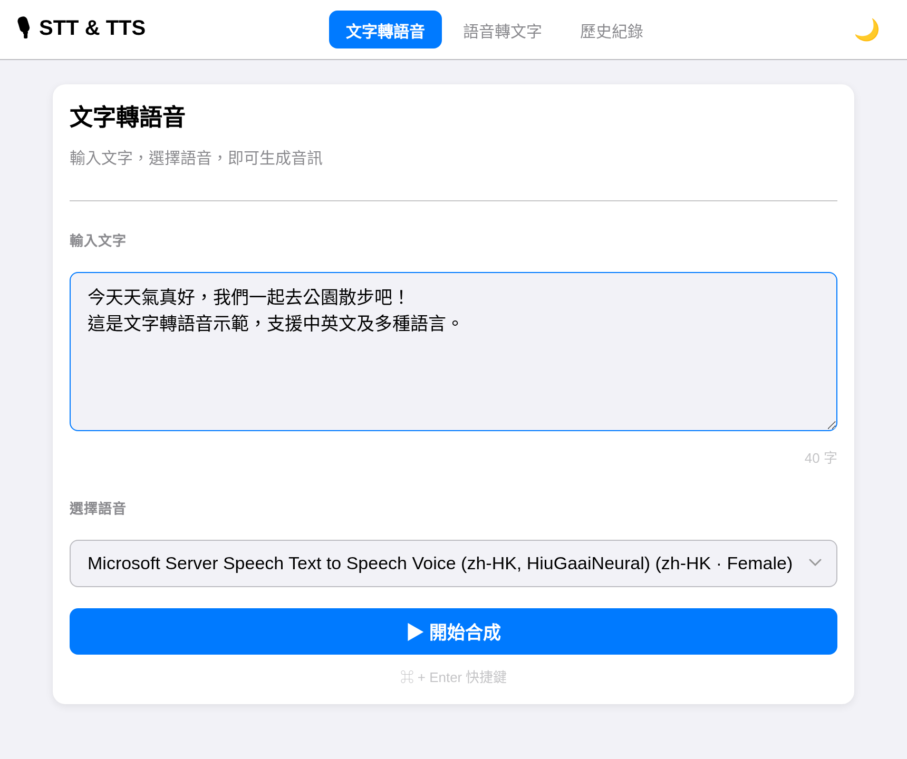
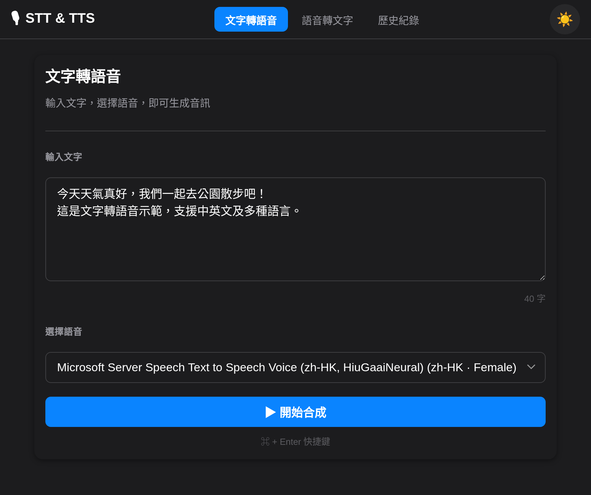
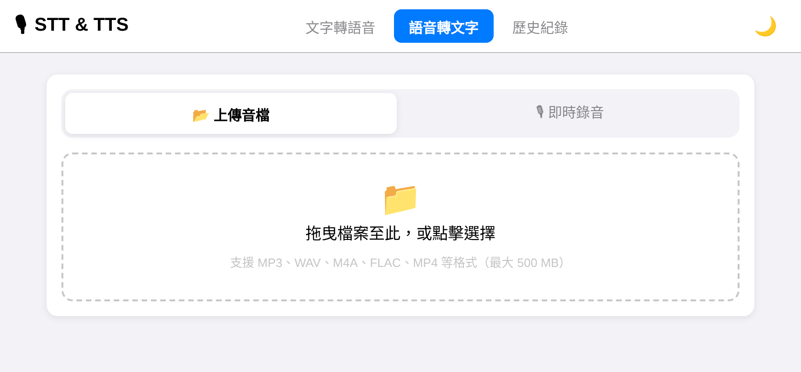
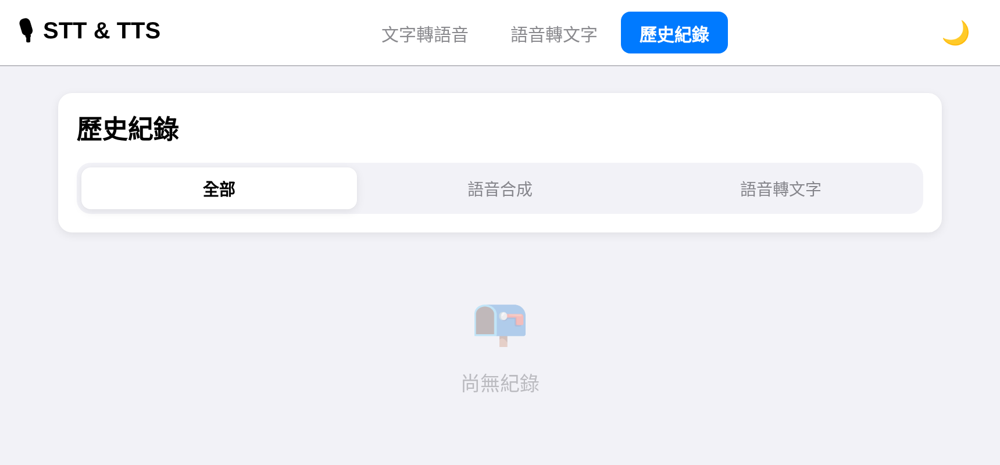

# STT-TTS Unified

語音合成（TTS）與語音辨識（STT）整合平台。

[](LICENSE)
[](https://www.python.org/)
[](https://fastapi.tiangolo.com/)
[](docker-compose.yml)
[](README.md#硬體需求)
[](README.md#費用)

> **無需 GPU，任何現代 CPU 即可執行。** Whisper 語音辨識完全在本機 CPU 上運行，無需任何雲端 API 或顯示卡。

- **TTS** — Microsoft Edge TTS，322 種多語言語音，自動偵測輸入語言動態篩選
- **STT** — OpenAI Whisper 本地執行（CPU），背景轉換、SSE 即時進度推送、完成瀏覽器通知
- **歷史紀錄** — SQLite 儲存所有合成與辨識結果，支援音檔播放與下載
- **Dark Mode** — Apple HIG 語意色彩系統，自動跟隨系統偏好

## 畫面截圖

| 文字轉語音（淺色） | 文字轉語音（深色） |
|---|---|
|  |  |

| 語音轉文字 | 歷史紀錄 |
|---|---|
|  |  |

## 快速開始

### Docker（推薦）

```bash
git clone <repo>
cd stt-tts-unified
make up
# → http://localhost:8008
```

### 本地開發

```bash
make install   # 安裝 Python venv + npm dependencies
make dev       # 啟動 backend:8000 + frontend:5173
```

詳細說明請見 [docs/development.md](docs/development.md)。

## Tech Stack

| 層級 | 技術 |
|---|---|
| 前端 | React 19 + Vite + TypeScript |
| 後端 | FastAPI + Uvicorn (Python 3.11) |
| TTS 引擎 | edge-tts (Microsoft Edge Neural TTS) |
| STT 引擎 | openai-whisper (本地執行) |
| 資料庫 | SQLite (aiosqlite) |
| 部署 | Docker Compose (multi-stage build) |

## 費用

**完全免費，無需任何 API Key。**

- Edge TTS：Microsoft 免費語音合成服務，需網路連線
- Whisper：Open-source 模型，完全在本機執行，可離線使用

## 硬體需求

**本專案設計為純 CPU 執行，不需要 GPU。**

| 資源 | 最低 | 建議 |
|---|---|---|
| CPU | 任意現代 CPU | 多核心 CPU |
| RAM | 4 GB | 8 GB+（使用 medium / large 模型）|
| 磁碟 | 5 GB | 10 GB（含 Docker image）|
| GPU | **不需要** | — |

> Whisper 預設使用 `base` 模型，在一般筆電 CPU 上約 10–30 秒可完成一段語音辨識。若需要更高精度可在 `config.yaml` 切換為 `small` 或 `medium`，無需任何硬體升級。

## 設定（config.yaml）

根目錄的 `config.yaml` 是主要設定檔，支援階層式設定：

```yaml
stt:
  engine: whisper
  whisper:
    model: base        # tiny | base | small | medium | large
    device: cpu        # cpu | cuda | mps
    language: auto

tts:
  engine: edge-tts
  edge_tts:
    default_voice: zh-TW-HsiaoChenNeural
    retry_count: 3
```

環境變數可覆蓋 YAML 設定（優先順序：env var > `.env` > `config.yaml`），命名規則為 `SECTION__SUBSECTION__KEY`，例如 `STT__WHISPER__MODEL=small`。

## 目錄結構

```
stt-tts-unified/
├── config.yaml         主要結構化設定檔
├── backend/            FastAPI 後端
│   ├── main.py         應用程式入口
│   ├── config.py       Pydantic nested settings（讀取 config.yaml + env var）
│   ├── database.py     SQLite 初始化
│   ├── routers/        API 路由（tts / stt / history / settings）
│   ├── services/
│   │   ├── protocols.py        STTEngine / TTSEngine Protocol 介面定義
│   │   ├── engine_factory.py   get_stt_engine() / get_tts_engine() 工廠函式
│   │   ├── whisper_service.py  WhisperEngine（實作 STTEngine Protocol）
│   │   ├── tts_service.py      EdgeTTSEngine（實作 TTSEngine Protocol）
│   │   └── history_service.py  SQLite CRUD
│   └── utils/          工具類（file_handler）
├── frontend/           React + Vite 前端
│   └── src/
│       ├── api/        API 客戶端
│       ├── components/ UI 元件
│       ├── context/    ThemeContext
│       └── styles/     Apple HIG CSS 變數
├── data/               執行時資料（gitignored）
│   ├── uploads/        上傳的音訊檔
│   ├── results/        Whisper 辨識結果
│   ├── audio/          TTS 生成音檔
│   └── history.db      SQLite 資料庫
├── docs/               技術文件
├── Makefile            常用指令
├── Dockerfile          Multi-stage build
└── docker-compose.yml
```

## 文件

- [API 文件](docs/api.md)
- [開發指南](docs/development.md)
- [架構說明](docs/architecture.md)
